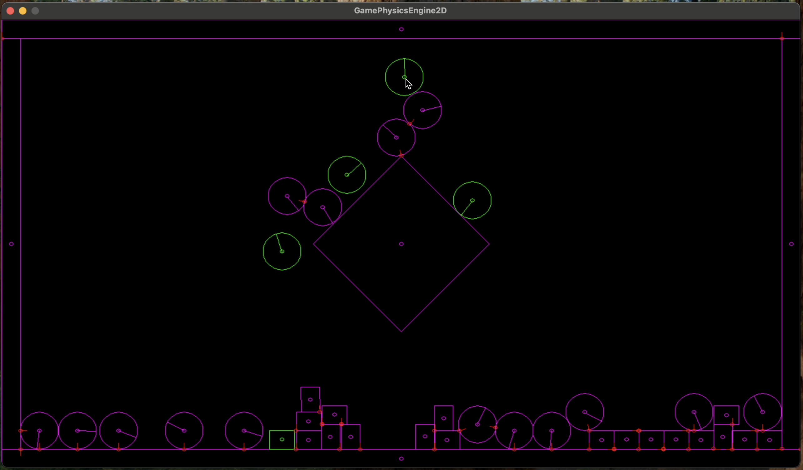

# GamePhysicsEngine2D

Toy implementation of a 2D rigid body simulator using the Impulse Method.

Following the ['Pikuma' 2D Game Physics Programming course](https://pikuma.com/courses/game-physics-engine-programming)



## Controls

- Press LEFT mouse button to drop a circle into the simulation, at the location of your mouse pointer
- Press RIGHT mouse button to drop a box into the simulation, at the location of your mouse pointer

## Dependencies

On MacOSX, use homebrew to install SDL2 dependencies.

```
brew install cmake
brew install sdl2
brew install sdl2_image
brew install sdl2_gfx
```

## Build

Make a build directory and initialise cmake.

```
mkdir build
cd build
cmake ..
```

While standing in the build directory, with with:

```
cmake --build .
```

While standing in the build directory, run with:

```
./GamePhysicsEngine2D     
```
